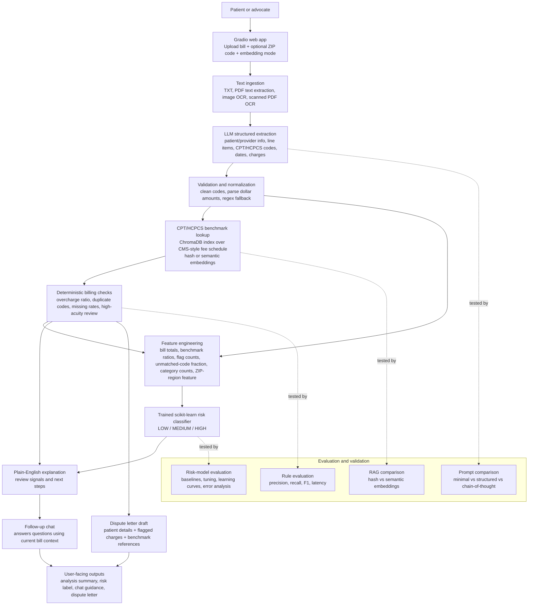

# Medical Billing Assistant

## What It Does

Medical Billing Assistant is a Gradio web app that helps patients understand and dispute confusing medical bills. A user uploads a bill as a PDF, image, or text file and optionally enters a ZIP code; the system extracts billing line items, identifies CPT/HCPCS codes and charges, compares those charges against a local Medicare fee schedule index, flags potential overcharges, duplicate charges, missing rates, and high-acuity review signals, runs a trained bill-risk classifier, then uses an OpenAI-compatible language model to explain the bill in plain English and draft a dispute letter.

## Why It Matters

Medical bills are difficult for many patients to interpret, and errors such as duplicate charges or unusually high markups are hard to spot without billing expertise. This project applies retrieval, language models, OCR/text extraction, and rule-based anomaly detection to make billing review more accessible.

## Related Work And Motivation

Medical billing is a well-documented source of patient confusion and financial harm. A systematic review of outpatient billing practices found that inaccurate coding is common, driven by lack of formal billing education, inadequate clinical documentation, and absent feedback systems (Burks et al., "A systematic review of outpatient billing practices," *SAGE Open Medicine* 10, 2022, DOI: 10.1177/20503121221099021). Meyer's patient journey analysis illustrates the problem from the consumer side: an 85-year-old patient spent ten months navigating conflicting communications, unclear Explanation of Benefits documents, and fragmented processes to resolve a single home infusion bill, with the billing issue still unresolved at the time of publication (Meyer, "A Patient's Journey to Pay a Healthcare Bill: It's Way Too Complicated," *Journal of Patient Experience* 10, 2023, DOI: 10.1177/23743735231174759).

Research from USC Schaeffer found that patients who challenge troubling medical bills often achieve meaningful reductions, suggesting that accessible decision-support tools could help more patients dispute billing errors effectively ("It's Worth Challenging That Troubling Medical Bill, Study Finds," USC Schaeffer Center, August 2024). On the technology side, Nasser's review of AI in medical billing documents how NLP and ML are being applied to automate coding, detect claim discrepancies, and reduce human error in billing workflows, while noting remaining challenges around data privacy and algorithmic bias (Nasser, "The Evolution of Automated Medical Billing With Artificial Intelligence," *Cureus* 17(11), 2025, DOI: 10.7759/cureus.96464).

CMS patient guidance emphasizes that medical bills should be compared against the Explanation of Benefits and checked for incorrect services, dates, amounts, and balance-due calculations ([CMS, "How to read your medical bill"](https://www.cms.gov/medical-bill-rights/help/guides/how-to-read-bill); [CMS, "Check your medical bill for errors"](https://www.cms.gov/medical-bill-rights/help/guides/bill-errors)). This project implements those patient-review tasks computationally: extract itemized line items, compare CPT/HCPCS codes to public Medicare benchmarks, flag duplicates and missing rates, run a trained risk classifier, and generate plain-English explanations and dispute letters.

## System Overview



The workflow is designed so the LLM handles messy language tasks, while exact billing-code lookup, benchmark comparison, flagging, and risk prediction stay structured and inspectable. The live app includes an embedding-mode selector: hash embeddings are the fast default, and sentence-transformer embeddings can be selected for the semantic retrieval path.

## Key Components

- `app.py`: Gradio interface with analysis, embedding-mode selection, chat, dispute-letter tabs, and visible loading indicators during model calls.
- `src/pdf_extract.py`: Text extraction from PDFs, images, and text files.
- `src/code_extract.py`: OpenAI-compatible LLM extraction of structured billing data, schema normalization, and a regex fallback for clean text bills.
- `src/rag.py`: ChromaDB index over a CMS-style Medicare fee schedule using deterministic local embeddings by default, with optional sentence-transformer embeddings selectable in the app.
- `src/analysis.py`: CPT/HCPCS-driven Medicare benchmark comparison plus rule-based overcharge, duplicate, high-acuity-code, and missing-rate checks.
- `src/features.py`: Feature engineering for the trained bill-risk classifier, including ratio, flag-count, category, and ZIP-region features.
- `src/risk_model.py`: Loads the trained scikit-learn classifier and predicts LOW/MEDIUM/HIGH bill risk.
- `src/explain.py`: Plain-English bill explanation and multi-turn chat.
- `src/dispute.py`: Formal dispute letter generation.
- `eval/evaluate_rules.py`: API-free evaluation harness for the production deterministic analysis path and index parity checks.
- `eval/evaluate_risk_model.py`: Trains/evaluates the supervised bill-risk classifier and writes model metrics.
- `eval/rag_comparison.py`: Compares hash-based and sentence-transformer retrieval over exact CPT/HCPCS lookups and description queries.
- `eval/error_analysis.py`: Reports risk-model misclassifications, scenario-level errors, edge cases, and diagnostic plots.
- `eval/prompt_comparison.py`: Compares three LLM extraction prompts; run with `--live` when API access is available.
- `scripts/train_risk_model.py`: Generates weakly supervised synthetic bills from CMS-style rates and trains baseline/logistic/random-forest classifiers.
- `scripts/download_cms_data.py`: Script used to convert CMS Physician Fee Schedule, Clinical Laboratory Fee Schedule, and anesthesia reference data into the project CSV format.

## Data And CPT/HCPCS Integration

The project uses CPT/HCPCS codes as the bridge between an uploaded bill and Medicare benchmark pricing:

1. The extraction step turns bill text into structured line items with `cpt_code`, description, billed amount, and date.
2. `src/analysis.py` passes each `cpt_code` into `src/rag.py`.
3. `src/rag.py` queries the ChromaDB fee-schedule index and returns the matching Medicare benchmark fee.
4. The analysis layer compares the billed charge to the benchmark and flags potential overcharges when the charge is more than 2x the benchmark.
5. Feature engineering converts the analysis into numeric model inputs such as bill-to-benchmark ratio, max line-item ratio, flag counts, procedure category counts, unmatched-code fraction, and a coarse ZIP-region multiplier.
6. A trained random-forest classifier predicts whether the bill is `LOW_RISK`, `MEDIUM_RISK`, or `HIGH_RISK`.
7. The UI reports pipeline status, including extraction method, selected embedding mode, matched codes, unmatched codes, risk model output, and warning messages.

The current `data/cms_fee_schedule.csv` contains 9,926 CMS-style fee-schedule rows derived from CMS Physician Fee Schedule, Clinical Laboratory Fee Schedule, and anesthesia reference data. The demo and evaluation bills are synthetic; the project should not be described as evaluated on real patient bills.

## Quick Start

See `SETUP.md` for detailed setup. Short version:

```bash
python3 -m venv .venv
source .venv/bin/activate
pip install -r requirements.txt
cp .env.example .env
# edit .env with your Duke GPT/OpenAI-compatible key and model
python scripts/build_index.py
python scripts/train_risk_model.py  # optional but recommended for risk scores
python app.py
```

Then open the Gradio URL and upload `data/sample_bill.txt` for a reliable demo. Use hash embeddings for the fastest run; switch to semantic embeddings when you want to demonstrate the sentence-transformer retrieval option.

## Hosted Demo

The app is deployed publicly on Hugging Face Spaces: [Medical Billing Assistant](https://huggingface.co/spaces/paulina-vvedenskaya/medical-billing-assistant).

For a smooth live demo, upload `data/sample_bill.txt`, enter ZIP code `27708`, leave the embedding mode on hash for the first run, then optionally rerun with semantic embeddings to show the retrieval toggle.

## Evaluation

The deterministic billing checks were evaluated on ten synthetic text bills covering clean bills, overcharges, duplicate charges, high-acuity code review, unknown codes, lab-heavy bills, anesthesia reference codes, date-sensitive duplicates, and mixed multi-flag cases. The evaluation builds the local ChromaDB index and calls the same production `run_all_checks()` path used by the app.

Run:

```bash
python eval/evaluate_rules.py
```

Current results from `eval/results.json`:

- Cases passed: 10/10
- Precision: 1.000
- Recall: 1.000
- F1: 1.000
- Average deterministic-check latency: about 11.78 ms per case
- Index parity check: sampled Chroma lookups matched the source CSV fees

This evaluation isolates the deterministic extraction-free analysis layer. The end-to-end app also depends on API availability, OCR quality, and the quality of LLM extraction/explanation.

The trained bill-risk classifier was evaluated on 1,800 weakly supervised synthetic bills generated from CMS-style fee schedule data. The model uses engineered billing features rather than raw images. A majority-class baseline, logistic regression model, tuned random forest, and gradient boosting model were compared.

Current results from `eval/risk_model_results.json`:

- Training examples: 1,350
- Test examples: 450
- Best model: tuned random forest
- Hyperparameter search: 30 random-forest configurations with 5-fold cross-validation; best CV macro F1: 0.9985
- Learning curve: final train macro F1 1.0000 and validation macro F1 0.9992; plot at `eval/plots/learning_curve.png`
- Gradient boosting training curve: final test accuracy 0.9911; plot at `eval/plots/training_curve_gb.png`
- Regularization comparison across 6 configurations: logistic regression without vs. with L2 penalty (test macro F1 0.9932 vs. 0.9887, train-test gap 0.0068 vs. 0.0038), gradient boosting without vs. with early stopping (test macro F1 0.9977 vs. 0.9909, 300 vs. 73 estimators), random forest without vs. with depth limits (both test macro F1 0.9955); plot at `eval/plots/regularization_comparison.png`
- Majority baseline macro F1: 0.172
- Logistic regression macro F1: 0.989
- Tuned random forest macro F1: 0.995
- Risk labels: `LOW_RISK`, `MEDIUM_RISK`, `HIGH_RISK`

Current error analysis from `eval/error_analysis_results.json`:

- Test accuracy: 0.9956 on 450 synthetic examples
- Misclassified examples: 2/450, both near-threshold high-acuity cases predicted `LOW_RISK` instead of `MEDIUM_RISK`
- Edge-case accuracy: 1.000 on 151 generated edge cases
- Diagnostic plots: `eval/plots/confusion_matrix.png` and `eval/plots/error_distribution.png`

Current retrieval comparison from `eval/rag_comparison_results.json`:

- Hash embeddings: exact CPT/HCPCS lookup accuracy of 1.000, description recall@5 of 0.167, and index build time about 3.77 seconds
- Sentence-transformer embeddings: exact CPT/HCPCS lookup accuracy of 1.000, description recall@5 of 0.250, and index build time about 24.75 seconds
- Exact CPT/HCPCS lookup is constrained by metadata filters, so it is embedding-independent once the expected-fee fixture matches `data/cms_fee_schedule.csv`
- The deployed app exposes both modes through the RAG embedding selector and reports the selected mode in Pipeline Status

Current live prompt comparison from `eval/prompt_comparison_results.json`:

- Prompt designs evaluated: minimal, structured, and chain-of-thought
- All three prompts had 1.000 code recall, item-count accuracy, total accuracy, and success rate across the three synthetic prompt-eval bills
- All three prompts had 0.667 average code precision because the evaluator assigns 0.0 precision to the no-code messy bill when no CPT/HCPCS codes are extracted
- Average latency: minimal 1,977 ms, structured 3,535 ms, chain-of-thought 3,408 ms

## Rubric Evidence Map

| Rubric area | Evidence |
| --- | --- |
| Modular code design | `src/pipeline.py` orchestrates focused modules for extraction, RAG lookup, deterministic checks, risk prediction, explanation, chat, and dispute letters. |
| Train/test split, baselines, hyperparameter tuning, regularization, and learning curves | `scripts/train_risk_model.py`, `eval/risk_model_results.json`, and `eval/plots/` include stratified 75/25 split, majority baseline, logistic regression, tuned random forest, gradient boosting, learning curves, and regularization comparisons. |
| Feature engineering | `src/features.py` converts bill analyses into ratios, flag counts, CPT/HCPCS category features, unmatched-code features, and ZIP-region features. |
| Prompt engineering with evaluation | `eval/prompt_comparison.py` and `eval/prompt_comparison_results.json` compare minimal, structured, and chain-of-thought extraction prompts. |
| LLM API integration and multi-turn chat | `src/llm.py`, `src/code_extract.py`, `src/explain.py`, `src/dispute.py`, and `app.py` integrate OpenAI-compatible calls for extraction, explanation, chat, and dispute generation. |
| Custom RAG pipeline | `src/rag.py` builds a Chroma index over CMS-style fee schedule rows, `app.py` exposes hash vs. semantic embedding selection, and `eval/rag_comparison.py` compares both modes. |
| Web deployment and production considerations | The Hugging Face Space linked above runs the app publicly; `app.py` includes rate limiting, logging, loading indicators, and user-facing error handling. |
| Evaluation and error analysis | `eval/evaluate_rules.py`, `eval/error_analysis.py`, and result JSON files report precision/recall/F1, latency, index parity, misclassified examples, and edge-case behavior. |

## Video Links

- Demo video: (https://drive.google.com/file/d/1r19WNUfrNj4eREVjfoDERWuuTVGEoMzk/view?usp=sharing)
- Technical walkthrough: 

## Limitations

- Medicare rates are used as a public benchmark, not a definitive fair-price rule.
- OCR quality depends on local Tesseract/poppler installation and document quality.
- LLM extraction can make mistakes, so the app validates the model output, includes a regex fallback for clean text bills, and should be treated as decision support rather than legal or financial advice.
- The fee schedule is a project-formatted CMS-style benchmark, not a full clinical billing database or a guarantee of patient-specific fair pricing.
- The default hash embeddings are lightweight and local for reliable setup; semantic embeddings are optional because they add model-loading time and dependency weight.
- Semantic embeddings are available in the app but can be slower on first use because the hosted Space may need to load or build the sentence-transformer index.
- CPT code descriptions may be subject to AMA licensing restrictions, so this project should be treated as educational decision support rather than a redistributed official CPT database.
- High-acuity-code flags are review signals, not proof of upcoding or fraud.
- The trained risk model is weakly supervised on synthetic CMS-grounded examples; it is not clinically validated and should not be treated as a final billing decision.

## Individual Contributions

Solo project. Paulina Vargas designed and implemented the project, including the Gradio app, bill extraction pipeline, Medicare-rate retrieval, anomaly checks, trained bill-risk classifier, LLM explanation/chat flow, dispute-letter generation, evaluation harness, deployment workflow, and documentation.
