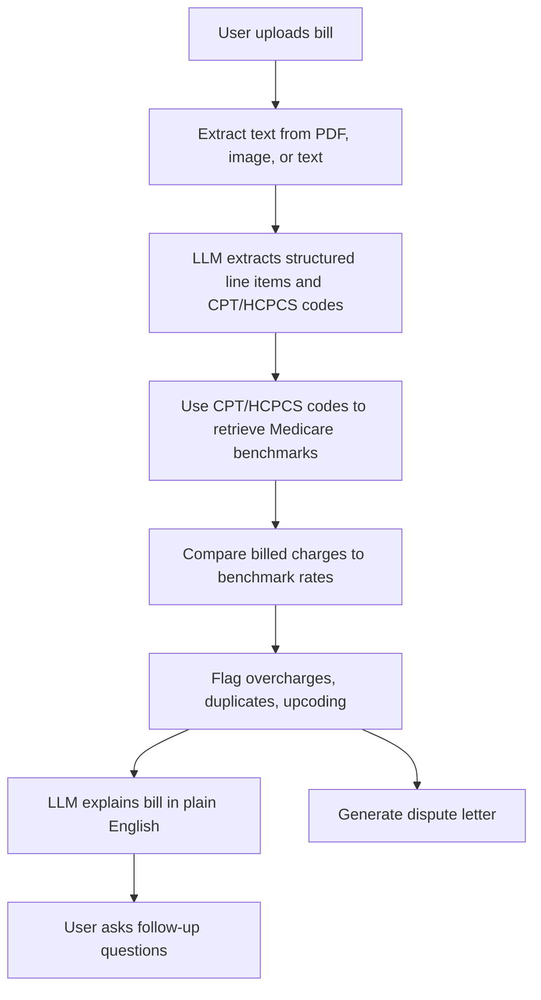

# Medical Billing Assistant

## What It Does

Medical Billing Assistant is a Gradio web app that helps patients understand and dispute confusing medical bills. A user uploads a bill as a PDF, image, or text file; the system extracts billing line items, identifies CPT/HCPCS codes and charges, compares those charges against a local Medicare fee schedule index, flags potential overcharges, duplicate charges, and upcoding patterns, then uses an OpenAI-compatible language model to explain the bill in plain English and draft a dispute letter.

## Why It Matters

Medical bills are difficult for many patients to interpret, and errors such as duplicate charges or unusually high markups are hard to spot without billing expertise. This project applies retrieval, language models, OCR/text extraction, and rule-based anomaly detection to make billing review more accessible.

## System Overview



## Key Components

- `app.py`: Gradio interface with analysis, chat, and dispute-letter tabs.
- `src/pdf_extract.py`: Text extraction from PDFs, images, and text files.
- `src/code_extract.py`: OpenAI-compatible LLM extraction of structured billing data, schema normalization, and a regex fallback for clean text bills.
- `src/rag.py`: ChromaDB index over a CMS-style Medicare fee schedule using deterministic local embeddings.
- `src/analysis.py`: CPT/HCPCS-driven Medicare benchmark comparison plus rule-based overcharge, duplicate, high-acuity-code, and missing-rate checks.
- `src/explain.py`: Plain-English bill explanation and multi-turn chat.
- `src/dispute.py`: Formal dispute letter generation.
- `eval/evaluate_rules.py`: API-free evaluation harness for the production deterministic analysis path and index parity checks.
- `scripts/download_cms_data.py`: Script used to convert CMS Physician Fee Schedule, Clinical Laboratory Fee Schedule, and anesthesia reference data into the project CSV format.

## Data And CPT/HCPCS Integration

The project uses CPT/HCPCS codes as the bridge between an uploaded bill and Medicare benchmark pricing:

1. The extraction step turns bill text into structured line items with `cpt_code`, description, billed amount, and date.
2. `src/analysis.py` passes each `cpt_code` into `src/rag.py`.
3. `src/rag.py` queries the ChromaDB fee-schedule index and returns the matching Medicare benchmark fee.
4. The analysis layer compares the billed charge to the benchmark and flags potential overcharges when the charge is more than 2x the benchmark.
5. The UI reports pipeline status, including extraction method, matched codes, unmatched codes, and warning messages.

The current `data/cms_fee_schedule.csv` contains 9,926 CMS-style fee-schedule rows derived from CMS Physician Fee Schedule, Clinical Laboratory Fee Schedule, and anesthesia reference data. The demo and evaluation bills are synthetic; the project should not be described as evaluated on real patient bills.

## Quick Start

See `SETUP.md` for detailed setup. Short version:

```bash
python3 -m venv .venv
source .venv/bin/activate
pip install -r requirements.txt
cp .env.example .env
# edit .env with your Duke GPT/OpenAI-compatible key and model
python scripts/build_index.py
python app.py
```

Then open the Gradio URL and upload `data/sample_bill.txt` for a reliable demo.

## Evaluation

The deterministic billing checks were evaluated on ten synthetic text bills covering clean bills, overcharges, duplicate charges, high-acuity code review, unknown codes, lab-heavy bills, anesthesia reference codes, date-sensitive duplicates, and mixed multi-flag cases. The evaluation builds the local ChromaDB index and calls the same production `run_all_checks()` path used by the app.

Run:

```bash
python eval/evaluate_rules.py
```

Current results from `eval/results.json`:

- Cases passed: 10/10
- Precision: 1.000
- Recall: 1.000
- F1: 1.000
- Average deterministic-check latency: about 22.55 ms per case
- Index parity check: sampled Chroma lookups matched the source CSV fees

This evaluation isolates the deterministic extraction-free analysis layer. The end-to-end app also depends on API availability, OCR quality, and the quality of LLM extraction/explanation.

## Video Links

- Demo video: TODO
- Technical walkthrough: TODO

## Limitations

- Medicare rates are used as a public benchmark, not a definitive fair-price rule.
- OCR quality depends on local Tesseract/poppler installation and document quality.
- LLM extraction can make mistakes, so the app validates the model output, includes a regex fallback for clean text bills, and should be treated as decision support rather than legal or financial advice.
- The fee schedule is a project-formatted CMS-style benchmark, not a full clinical billing database or a guarantee of patient-specific fair pricing.
- The retrieval embeddings are lightweight and local for reliable setup, not a large pretrained semantic embedding model.
- CPT code descriptions may be subject to AMA licensing restrictions, so this project should be treated as educational decision support rather than a redistributed official CPT database.
- High-acuity-code flags are review signals, not proof of upcoding or fraud.

## Individual Contributions

Paulina Vargas designed and implemented the project, including the Gradio app, bill extraction pipeline, Medicare-rate retrieval, anomaly checks, LLM explanation/chat flow, dispute-letter generation, evaluation harness, and documentation.
