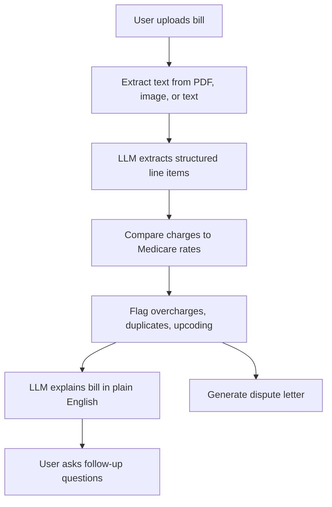

# Medical Billing Assistant

## What It Does

Medical Billing Assistant is a Gradio web app that helps patients understand and dispute confusing medical bills. A user uploads a bill as a PDF, image, or text file; the system extracts billing line items, identifies CPT/HCPCS codes and charges, compares those charges against a local Medicare fee schedule index, flags potential overcharges, duplicate charges, and upcoding patterns, then uses an OpenAI-compatible language model to explain the bill in plain English and draft a dispute letter.

## Why It Matters

Medical bills are difficult for many patients to interpret, and errors such as duplicate charges or unusually high markups are hard to spot without billing expertise. This project applies retrieval, language models, OCR/text extraction, and rule-based anomaly detection to make billing review more accessible.

## System Overview



## Key Components

- `app.py`: Gradio interface with analysis, chat, and dispute-letter tabs.
- `src/pdf_extract.py`: Text extraction from PDFs, images, and text files.
- `src/code_extract.py`: OpenAI-compatible LLM extraction of structured billing data, with a regex fallback for clean text bills.
- `src/rag.py`: ChromaDB index over the local CMS-style fee schedule using deterministic local embeddings.
- `src/analysis.py`: Rule-based overcharge, duplicate, and upcoding checks.
- `src/explain.py`: Plain-English bill explanation and multi-turn chat.
- `src/dispute.py`: Formal dispute letter generation.
- `eval/evaluate_rules.py`: API-free evaluation harness for deterministic anomaly detection.

## Quick Start

See `SETUP.md` for detailed setup. Short version:

```bash
python3 -m venv .venv
source .venv/bin/activate
pip install -r requirements.txt
cp .env.example .env
# edit .env with your Duke GPT/OpenAI-compatible key and model
python scripts/build_index.py
python app.py
```

Then open the Gradio URL and upload `data/sample_bill.txt` for a reliable demo.

## Evaluation

The deterministic billing checks were evaluated on five synthetic text bills covering clean bills, overcharges, duplicate charges, upcoding, and mixed multi-flag cases.

Run:

```bash
python eval/evaluate_rules.py
```

Current results from `eval/results.json`:

- Cases passed: 5/5
- Precision: 1.000
- Recall: 1.000
- F1: 1.000
- Average deterministic-check latency: about 0.05 ms per case

This evaluation isolates the deterministic anomaly-detection layer. The end-to-end app also depends on API availability, OCR quality, and the quality of LLM extraction/explanation.

## Video Links

- Demo video: TODO
- Technical walkthrough: TODO

## Limitations

- Medicare rates are used as a public benchmark, not a definitive fair-price rule.
- OCR quality depends on local Tesseract/poppler installation and document quality.
- LLM extraction can make mistakes, so the app includes a regex fallback for clean text bills and should be treated as decision support rather than legal or financial advice.
- The local fee schedule is a small project dataset, not a complete CMS production fee schedule.
- The retrieval embeddings are lightweight and local for reliable setup, not a large pretrained semantic embedding model.

## Individual Contributions

Paulina Vargas designed and implemented the project, including the Gradio app, bill extraction pipeline, Medicare-rate retrieval, anomaly checks, LLM explanation/chat flow, dispute-letter generation, evaluation harness, and documentation.
